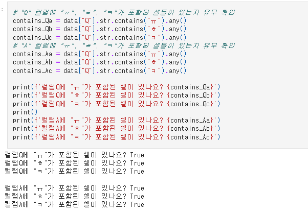

# AIFFEL Campus Online Code Peer Review Templete
- 코더 : 담안용
- 리뷰어 : 서승환


# PRT(Peer Review Template)
- [O]  **1. 주어진 문제를 해결하는 완성된 코드가 제출되었나요?**
    - 문제에서 요구하는 최종 결과물이 첨부되었는지 확인
        - 중요! 해당 조건을 만족하는 부분을 캡쳐해 근거로 첨부
    


	루브릭을 제대로 수행하며 프로젝트를 완료하였음

- [O]  **2. 전체 코드에서 가장 핵심적이거나 가장 복잡하고 이해하기 어려운 부분에 작성된 
주석 또는 doc string을 보고 해당 코드가 잘 이해되었나요?**
    - 해당 코드 블럭을 왜 핵심적이라고 생각하는지 확인
    - 해당 코드 블럭에 doc string/annotation이 달려 있는지 확인
    - 해당 코드의 기능, 존재 이유, 작동 원리 등을 기술했는지 확인
    - 주석을 보고 코드 이해가 잘 되었는지 확인
        - 중요! 잘 작성되었다고 생각되는 부분을 캡쳐해 근거로 첨부
    


	실험 하신 부분에 대한 주석이 잘 적혀 있어 이해하기 쉬웠음

    
- [O]  **3. 에러가 난 부분을 디버깅하여 문제를 해결한 기록을 남겼거나
새로운 시도 또는 추가 실험을 수행해봤나요?**
    - 문제 원인 및 해결 과정을 잘 기록하였는지 확인
    - 프로젝트 평가 기준에 더해 추가적으로 수행한 나만의 시도, 
    실험이 기록되어 있는지 확인
        - 중요! 잘 작성되었다고 생각되는 부분을 캡쳐해 근거로 첨부


	accuracy 값을 높이기 위한 노력들이 잘 보여짐

        
- [O]  **4. 회고를 잘 작성했나요?**
    - 주어진 문제를 해결하는 완성된 코드 내지 프로젝트 결과물에 대해
    배운점과 아쉬운점, 느낀점 등이 기록되어 있는지 확인
    - 전체 코드 실행 플로우를 그래프로 그려서 이해를 돕고 있는지 확인
        - 중요! 잘 작성되었다고 생각되는 부분을 캡쳐해 근거로 첨부
    
	작성되어 있지 않지만 이야기를 나눴을때 회고를 잘 들을 수 있었음
    
- [O]  **5. 코드가 간결하고 효율적인가요?**
    - 파이썬 스타일 가이드 (PEP8) 를 준수하였는지 확인
    - 코드 중복을 최소화하고 범용적으로 사용할 수 있도록 함수화/모듈화했는지 확인
        - 중요! 잘 작성되었다고 생각되는 부분을 캡쳐해 근거로 첨부


	early_stopping을 사용해 적절한 에포크 값에 학습을 중단해 효율적으로 진행함 


# 회고(참고 링크 및 코드 개선)
```
# 리뷰어의 회고를 작성합니다.
# 코드 리뷰 시 참고한 링크가 있다면 링크와 간략한 설명을 첨부합니다.
# 코드 리뷰를 통해 개선한 코드가 있다면 코드와 간략한 설명을 첨부합니다.


안용님 코드를 보고나서 나도 early_stopping을 사용할껄.... 이라는 생각이 들었습니다!

또한 데이터 셋을 훈련 / 테스트 셋으로 나누신것도 좋은 아이디어인 거 같습니다!!!

```
